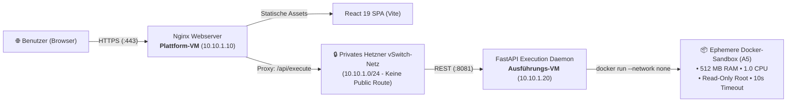

# 🎓 CodeLab Lernplattform

[](https://react.dev/)
[](https://www.typescriptlang.org/)
[](https://vite.dev/)
[](https://tailwindcss.com/)
[](https://www.docker.com/)
[](https://nginx.org/)

> **Praxiskomponente der Bachelor-Praxisarbeit:**  
> *„Evaluation von Terraform und OpenTofu zur sicheren Bereitstellung isolierter Codeausführungsumgebungen in der Cloud“*  
> Erfüllt **Anforderung A2 (Funktionsfähige Lernplattform)** als interaktives Frontend und Validierungssystem für die evaluierte Cloud-Infrastruktur.

> [!NOTE]
> **Hinweis zur Entstehung & Zielsetzung:**  
> Diese Webanwendung wurde mit Unterstützung von generativer KI erstellt. Der wissenschaftliche und technische Kern dieser Praxisarbeit liegt auf dem **Vergleich und der Evaluation von Terraform und OpenTofu** zur sicheren, automatisierten Bereitstellung von Cloud-Ressourcen. Die Plattform dient ausschließlich zu **Demonstrations- und Testzwecken**, um die Netzwerktrennung, API-Kommunikation und Docker-Sandbox der bereitgestellten Infrastruktur realitätsnah zu erproben und zu verifizieren.

---

## 📑 Inhaltsverzeichnis

1. [Überblick & Zielsetzung](#-überblick--zielsetzung)
2. [Hauptfunktionen](#-hauptfunktionen)
   - [1. Interaktiver Code-Editor & Playground](#1-interaktiver-code-editor--playground)
   - [2. Architektur- & Sicherheits-Explorer](#2-architektur---sicherheits-explorer)
   - [3. Echtzeit-Health-Monitoring & Daemon-Audit](#3-echtzeit-health-monitoring--daemon-audit)
3. [Architektur-Einbettung (Zwei-VM-Setup)](#-architektur-einbettung-zwei-vm-setup)
4. [Technologie-Stack](#-technologie-stack)
5. [Projektstruktur](#-projektstruktur)
6. [Schnellstart & Lokale Entwicklung](#-schnellstart--lokale-entwicklung)
7. [Container-Betrieb (Docker & Nginx)](#-container-betrieb-docker--nginx)
8. [Verfügbare Skripte](#-verfügbare-skripte)
9. [Bezug zu den Anforderungen der Praxisarbeit](#-bezug-zu-den-anforderungen-der-praxisarbeit)

---

## 📖 Überblick & Zielsetzung

Die **CodeLab Lernplattform** dient im Rahmen der wissenschaftlichen Praxisarbeit als greifbares Anwendungsbeispiel und Testsystem. Sie simuliert eine moderne E-Learning-Plattform (ähnlich wie LeetCode, Codecademy oder Exercism), auf der Lernende Programmieraufgaben lösen und deren Ausführung in Echtzeit überprüfen lassen können.

Im Fokus der Bachelorarbeit steht nicht nur die Bereitstellung des Frontends, sondern vor allem die **Infrastrukturautomatisierung mittels Terraform und OpenTofu**:
* Die Lernplattform läuft auf einer **öffentlichen Plattform-VM** hinter einem Nginx-Reverse-Proxy.
* Ungetesteter, potenziell schädlicher Benutzercode wird über ein **privates vSwitch-Netzwerk** an eine **vollständig isolierte Ausführungs-VM** (ohne öffentliche IP) übergeben.
* Dort wird der Code in kurzlebigen, streng limitierten Docker-Sandboxes ausgeführt (**Anforderung A5**).

---

## 🌟 Hauptfunktionen

### 1. Interaktiver Code-Editor & Playground
* **Multi-Language-Support:** Nahtloser Wechsel zwischen **Python**, **JavaScript (Node.js)** und **Java**.
* **Monaco Code-Editor:** Integration des VS-Code-Editors im Webbrowser mit Syntax-Highlighting, Autovervollständigung, Zeilennummerierung und Einrückungshilfen.
* **Lerneinheiten (`/lektion/:id`) & Freier Modus (`/playground`):**
  * Strukturierte Programmieraufgaben mit Aufgabenstellungen, Codevorlagen und automatischer Validierung.
  * Freier Spielplatz für beliebige Code-Experimente mit Zeit- und Ressourcenmessung.
* **Hybride Ausführungsarchitektur (Ausfallsicherheit):**
  * **Online-Modus (Primär):** Übergabe des Codes via REST-Anfrage an den *Code Execution Service* auf der Hetzner-Cloud-Infrastruktur.
  * **Client-Fallback (Offline):** Ist das Backend nicht erreichbar oder deaktiviert, greift automatisch ein browserbasierter Interpreter. Die Plattform bleibt zu Präsentationszwecken 100% bedienbar.

### 2. Architektur- & Sicherheits-Explorer (`/architektur`)
* **Topologie-Diagramm (Tab 1):** Interaktives Mermaid-Flowchart der Cloud-Infrastruktur (Plattform-VM, privates Subnetz `10.10.1.0/24`, Ausführungs-VM, Docker-Sandbox).
* **Ablauf-Sequenzdiagramm (Tab 2):** Detaillierter Ablauf eines Code-Ausführungsauftrags inklusive Timeouts, temporären Dateien und Metadaten-Rückgabe.
* **Interaktive Werkzeuge:**
  * Stufenlose Zoom- & Pan-Steuerung mit Größenregler (S, M, L, XL, 2XL sowie 100% Vollbreite).
  * **Wissenschaftlicher Multiformat-Export:**
    * ☀️ **Druckversion (Weiß):** Kontrastreicher weißer Hintergrund mit dunkler Tinte für PDFs & Word-Arbeiten.
    * 🌙 **Präsentation (Dunkel):** Dunkler Hintergrund für Beamer-Präsentationen und Web-Präsentationen.
    * 🪟 **Transparent (Helles Design):** Freigestellter Alphakanal mit dunklen Linien für wissenschaftliche Ausarbeitungen (LaTeX / Word).
    * ✨ **Transparent (Dunkles Design):** Freigestellter Alphakanal mit hellen Linien für dunkle Dokumente/Slides.
    * 📐 **Vektor-SVG:** Skalierbare Vektorgrafik für maximale Druckauflösung ohne Artefakte.
* **Spezifikation & Versuchszyklus (Tab 3):** Vollständige Anforderungsdokumentation (**A1–A7**) sowie der 10-stufige Versuchszyklus.
* **Benchmark-Vergleich (Tab 4):** Interaktive Gegenüberstellung von Terraform und OpenTofu anhand der Evaluationskriterien **K1–K5**.

### 3. Echtzeit-Health-Monitoring & Daemon-Audit
* **Hintergrund-Health-Check:** Die Navbar prüft periodisch (alle 8s) sowie bei Fokuswechsel (`visibilitychange` / `window.focus`) den Status des Ausführungsdienstes (`/health`).
* **Strikte Zustandsbewertung:** Das System zeigt nur dann *"Hetzner: Verbunden"* (grüner Indikator), wenn der HTTP-Status 200 lautet **und** die Docker-Engine auf der VM einsatzbereit ist (`dockerAvailable: true`).
* **Audit-Popover:** Klick auf das Status-Pill zeigt Latenz in Millisekunden, Backend-URL, Docker-Verfügbarkeit und aktive Sprachen an.

---

## 🏛️ Architektur-Einbettung (Zwei-VM-Setup)

In der evaluierten Cloud-Infrastruktur (Hetzner Cloud) bildet die Lernplattform die Benutzerschnittstelle auf der **öffentlichen Plattform-VM**:



### Netzwerk- und Port-Matrix

| Komponente | VM | Interne IP | Offene Ports | Zugriff |
| :--- | :--- | :--- | :--- | :--- |
| **Lernplattform (Nginx)** | Plattform-VM | `10.10.1.10` | `80/tcp`, `443/tcp` | Öffentlich (Internet) |
| **Execution Daemon** | Ausführungs-VM | `10.10.1.20` | `8081/tcp` | Streng limitiert: Nur `10.10.1.10` via vSwitch |
| **Docker-Sandbox** | Ausführungs-VM | *Keine* (`--net none`) | *Keine* | Isoliert (kein Netzwerkzugriff) |

---

## 🛠️ Technologie-Stack

| Bereich | Technologie | Version / Details | Zweck |
| :--- | :--- | :--- | :--- |
| **Frontend-Framework** | [React](https://react.dev/) | 19.x | Deklarative UI-Entwicklung mit Funktionskomponenten |
| **Programmiersprache** | [TypeScript](https://www.typescriptlang.org/) | 5.x | Typensichere Datenstrukturen für API & Execution |
| **Build-Tool** | [Vite](https://vite.dev/) | 6.x | Schnelle HMR und performanter Rollup-Produktions-Build |
| **Styling** | [Tailwind CSS](https://tailwindcss.com/) | v4.x | Modernes Utility-First CSS-Designsystem (Dark-Mode) |
| **Code-Editor** | [@monaco-editor/react](https://github.com/suren-atoyan/monaco-react) | 4.7.x | Industriestandard-Code-Editor mit IntelliSense |
| **Diagramme** | [Mermaid.js](https://mermaid.js.org/) | 11.x | Dynamische Architektur- und Sequenzvisualisierung |
| **Icons** | [Lucide React](https://lucide.dev/) | 1.x | Konsistente SVG-Icons für Benutzeroberfläche |
| **Container & Host** | [Nginx](https://hub.docker.com/_/nginx) | Alpine | Schlanker Webserver für statische Assets & API-Proxy |
| **Paketverwaltung** | [pnpm](https://pnpm.io/) | 10.x | Schnelle, speichereffiziente Paketverwaltung |

---

## 📁 Projektstruktur

```
praxisteil/lernplattform/
├── .env                         # Lokale Umgebungsvariablen (VITE_API_BASE_URL)
├── .env.example                 # Vorlage für Umgebungskonfiguration
├── Dockerfile                   # Multi-Stage Build: Node 20 Build ➔ Nginx Alpine Host
├── docker-compose.yml           # Lokale Container-Orchestrierung (Port 8080)
├── nginx.conf                   # Nginx-Konfiguration mit SPA-Routing und /api/-Proxy
├── package.json                 # Projektabhängigkeiten und Skripte
├── vite.config.ts               # Vite-Konfiguration mit React- und Tailwind-Plugins
├── index.html                   # HTML5-Einstiegsdatei mit Schriftarten & Metadaten
├── src/
│   ├── main.tsx                 # React-Initialisierung und Root-Router
│   ├── index.css                # Globale Styles und Tailwind-Tokens
│   ├── types/
│   │   ├── execution.ts         # Schnittstellen für Runner-Requests, Responses & Health
│   │   └── lesson.ts            # Typdefinitionen für Aufgaben und Lektionen
│   ├── services/
│   │   ├── api.ts               # API-Client für /health und /execute mit Latenzmessung
│   │   └── localInterpreter.ts  # Browser-basierter Mock-Fallback bei Offline-Betrieb
│   ├── data/
│   │   └── lessonsData.ts       # Aufgabenstellungen, Testcases und Code-Vorlagen
│   ├── components/
│   │   ├── layout/              # Navbar (inkl. Live-Health-Pill), Header & Footer
│   │   ├── editor/              # Monaco Editor-Komponente, Terminal-Output & Controls
│   │   ├── common/              # MermaidViewer (Zoom, Pan, Multiformat-Export), MDX
│   │   └── architecture/        # BenchmarkComparison (K1–K5 Kriterien-Matrix)
│   └── pages/
│       ├── HomePage.tsx         # Übersicht, Praxisarbeits-Kontext & Schnellzugriff
│       ├── ArchitecturePage.tsx # 4 Tabs: Topologie, Sequenz, Spezifikation, Benchmarks
│       ├── LessonPage.tsx       # Interaktive Programmierlektionen mit Monaco-Editor
│       └── PlaygroundPage.tsx   # Freier Code-Editor für Ad-hoc-Experimente
```

---

## 🚀 Schnellstart & Lokale Entwicklung

### Voraussetzungen
* **Node.js:** Version $\ge$ 20.x
* **pnpm:** Version $\ge$ 10.x  
  *(Aktivierbar via Corepack: `corepack enable && corepack prepare pnpm@latest --activate`)*
* Optional: Laufender *Code Execution Service* (z. B. auf Port `8081` oder `8080`)

### 1. Abhängigkeiten installieren
```bash
cd praxisteil/lernplattform
pnpm install
```

### 2. Umgebung konfigurieren (`.env`)
Erstelle bei Bedarf eine `.env`-Datei auf Basis von `.env.example`:
```env
# Verbindung zum lokalen Execution Runner:
VITE_API_BASE_URL=http://localhost:8081

# Bei leerem Wert nutzt die Plattform im Browser den internen Mock-Fallback
```

### 3. Entwicklungsserver starten
```bash
pnpm dev
```
Die Anwendung steht unter **`http://localhost:5173`** mit Hot Module Replacement (HMR) bereit.

---

## 🐳 Container-Betrieb (Docker & Nginx)

Die Lernplattform lässt sich für Tests oder den produktiven Einsatz auf der Plattform-VM als Docker-Container betreiben. Das Multi-Stage `Dockerfile` baut die Assets via Node.js und bettet sie in ein minimales Nginx-Alpine-Image ein.

### Container lokal starten
```bash
docker compose up -d --build
```
Die Plattform ist anschließend unter **`http://localhost:8080`** erreichbar.

### Container stoppen
```bash
docker compose down
```

---

## 📜 Verfügbare Skripte

| Befehl | Aktion |
| :--- | :--- |
| `pnpm dev` | Startet den Vite-Entwicklungsserver mit Hot Module Replacement (`localhost:5173`). |
| `pnpm build` | Führt die TypeScript-Typprüfung (`tsc -b`) aus und erzeugt optimierte Produktions-Assets in `dist/`. |
| `pnpm preview`| Startet einen lokalen Vorschau-Server für den `dist/`-Produktions-Build. |
| `pnpm lint` | Analysiert den Code mit dem schnellen [Oxlint](https://oxc.rs/)-Linter auf Code-Qualität. |

---

## 🎯 Bezug zu den Anforderungen der Praxisarbeit

Die Lernplattform erfüllt zentrale Anforderungen der wissenschaftlichen Untersuchung:

| Anforderung | Umsetzung in der Lernplattform |
| :--- | :--- |
| **A2: Funktionsfähige Lernplattform** | Vollständiges Web-Frontend für Python, JavaScript und Java. Codeeingabe, Absenden, Anzeige von `stdout`, `stderr`, Rückgabewert (Exit-Code) und Ausführungsdauer in ms. |
| **A5: Begrenzte Ausführung** | UI-Visualisierung von Timeouts (Exit-Code 124) und Limit-Überschreitungen (Memory Out-of-Bounds). |
| **A6: Logging ohne Geheimnisse** | Verifikation im Client, dass keine sensiblen Daten übermittelt werden; Logging beschränkt sich auf Job-IDs, Latenzen und Statuscodes. |
| **K1–K5 Evaluation** | Integrierte Benchmark-Matrix und Versuchszyklus-Dokumentation direkt im Webinterface (`/architektur?tab=benchmarks`) zur Evaluation von Terraform vs. OpenTofu. |
